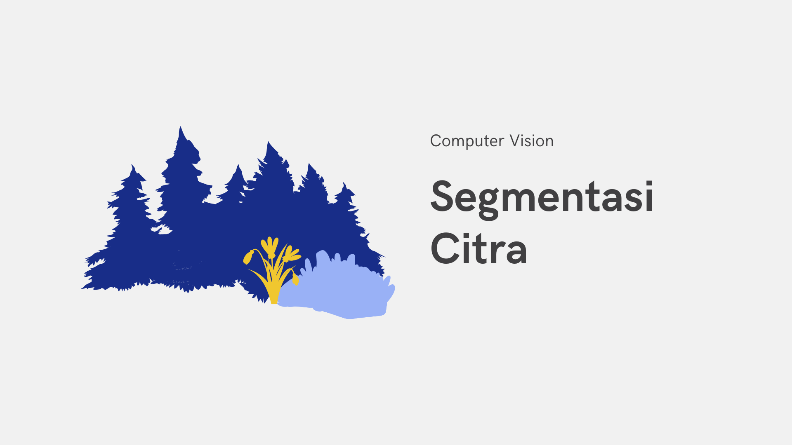
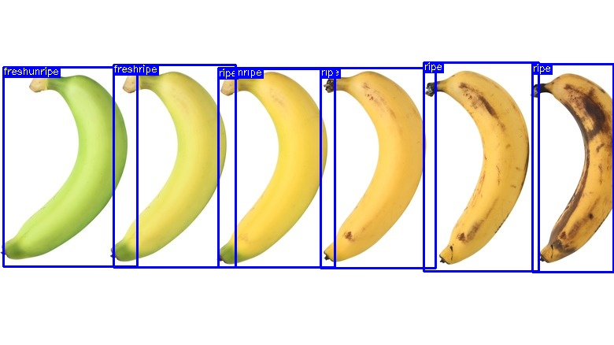

# Team Members
1. Alvian Rahmadani Saputra
2. Khanafi
3. Janualitta Yanabilah

## Project Overview
This repository contains the program files developed for a Computer Vision course. The project is focused on implementing real-time video processing techniques that can be applied to various computer vision tasks. The methods and techniques implemented include:
1. Blurring
   
   Techniques for reducing image noise and smoothing frames.

2. Filtering

   Implementation of spatial and frequency domain filters.
3. Noise Reduction

    Methods to enhance video quality by mitigating unwanted noise.
4. Binary Vision Processing
   * Edge Detection : Identifying object boundaries within frames.
   * Segmentation : Dividing images into meaningful regions.
   * Thresholding : Converting images to binary format based on intensity values.
5. Color Processing
   * Color Detection : Identifying specific colors in video frames.
   * Color Convertion : Transforming images between different color spaces (e.g., RGB to HSV).
6. Video Transformation
   * Affine : Preserving collinearity and parallelism during transformations.
   * Mirroring : Reflecting video frames horizontally or vertically.
   * Rotating : Rotating frames to a desired angle.
   * Scaling : Resizing video frames.
   * Skewing : Distorting video frames.
   * Translating : Shifting video frames in space.

## Project Goal

The ultimate goal of this project is to develop a real-time fruit ripeness detection system. This system uses advanced computer vision techniques, specifically employing YOLOv5, a state-of-the-art object detection framework. The RoboFlow platform was utilized for dataset preparation and model training.

## Project Presentation
[Link to canva presentation](https://www.canva.com/design/DAFz6jb_hw8/7UQTstVDB6DZcM3GwKu_Ag/view?utm_content=DAFz6jb_hw8&utm_campaign=designshare&utm_medium=link&utm_source=editor)

## Screenshots
